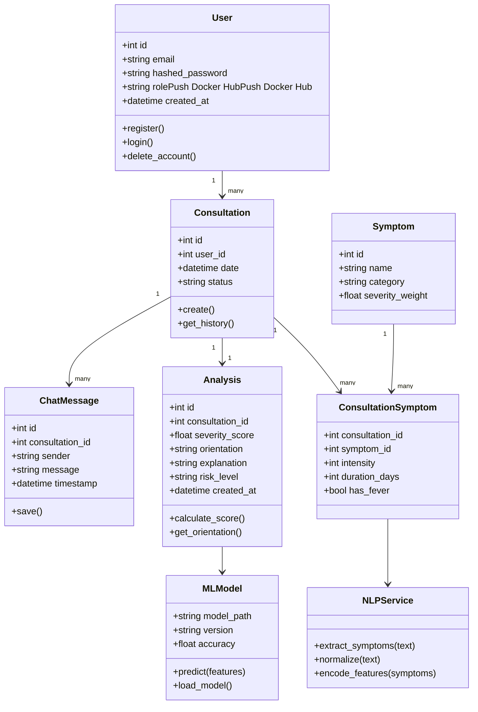

```mermaid
classDiagram

class User {
    +int id
    +string email
    +string hashed_password
    +string rolePush Docker HubPush Docker Hub
    +datetime created_at
    +register()
    +login()
    +delete_account()
}

class Consultation {
    +int id
    +int user_id
    +datetime date
    +string status
    +create()
    +get_history()
}

class Symptom {
    +int id
    +string name
    +string category
    +float severity_weight
}

class ConsultationSymptom {
    +int consultation_id
    +int symptom_id
    +int intensity
    +int duration_days
    +bool has_fever
}

class Analysis {
    +int id
    +int consultation_id
    +float severity_score
    +string orientation
    +string explanation
    +string risk_level
    +datetime created_at
    +calculate_score()
    +get_orientation()
}

class ChatMessage {
    +int id
    +int consultation_id
    +string sender
    +string message
    +datetime timestamp
    +save()
}

class MLModel {
    +string model_path
    +string version
    +float accuracy
    +predict(features)
    +load_model()
}

class NLPService {
    +extract_symptoms(text)
    +normalize(text)
    +encode_features(symptoms)
}

User "1" --> "many" Consultation
Consultation "1" --> "many" ConsultationSymptom
Symptom "1" --> "many" ConsultationSymptom
Consultation "1" --> "1" Analysis
Consultation "1" --> "many" ChatMessage
Analysis --> MLModel
ConsultationSymptom --> NLPService
```