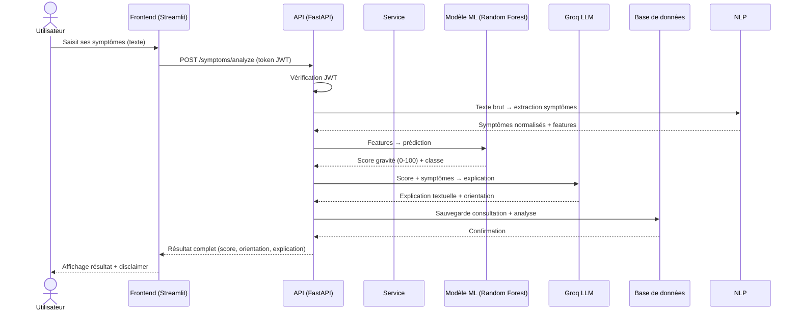

```mermaid
sequenceDiagram
    actor U as Utilisateur
    participant F as Frontend (Streamlit)
    participant A as API (FastAPI)
    participant Service 
    participant ML as Modèle ML (Random Forest)
    participant LLM as Groq LLM
    participant DB as Base de données

    U->>F: Saisit ses symptômes (texte)
    F->>A: POST /symptoms/analyze (token JWT)
    A->>A: Vérification JWT
    A->>NLP: Texte brut → extraction symptômes
    NLP-->>A: Symptômes normalisés + features
    A->>ML: Features → prédiction
    ML-->>A: Score gravité (0-100) + classe
    A->>LLM: Score + symptômes → explication
    LLM-->>A: Explication textuelle + orientation
    A->>DB: Sauvegarde consultation + analyse
    DB-->>A: Confirmation
    A-->>F: Résultat complet (score, orientation, explication)
    F-->>U: Affichage résultat + disclaimer
```