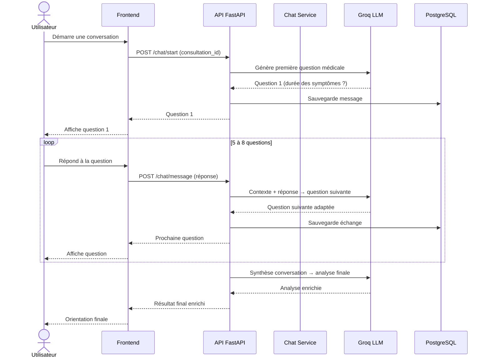

```mermaid
sequenceDiagram
    actor U as Utilisateur
    participant F as Frontend
    participant A as API FastAPI
    participant C as Chat Service
    participant LLM as Groq LLM
    participant DB as PostgreSQL

    U->>F: Démarre une conversation
    F->>A: POST /chat/start (consultation_id)
    A->>LLM: Génère première question médicale
    LLM-->>A: Question 1 (durée des symptômes ?)
    A->>DB: Sauvegarde message
    A-->>F: Question 1
    F-->>U: Affiche question 1

    loop 5 à 8 questions
        U->>F: Répond à la question
        F->>A: POST /chat/message (réponse)
        A->>LLM: Contexte + réponse → question suivante
        LLM-->>A: Question suivante adaptée
        A->>DB: Sauvegarde échange
        A-->>F: Prochaine question
        F-->>U: Affiche question
    end

    A->>LLM: Synthèse conversation → analyse finale
    LLM-->>A: Analyse enrichie
    A-->>F: Résultat final enrichi
    F-->>U: Orientation finale
```