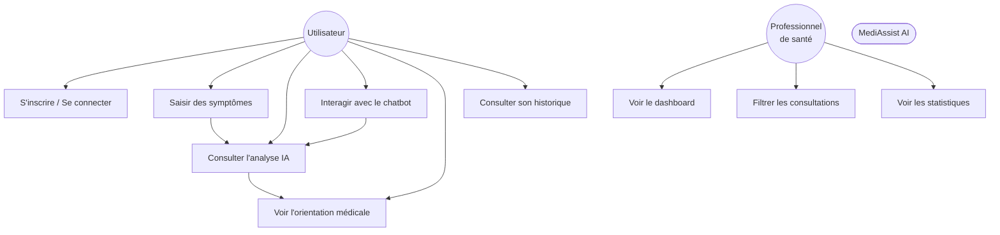

```mermaid
graph TD
    User((Utilisateur))
    Admin((Professionnel\nde santé))
    System([MediAssist AI])

    User --> UC1[S'inscrire / Se connecter]
    User --> UC2[Saisir des symptômes]
    User --> UC3[Consulter l'analyse IA]
    User --> UC4[Interagir avec le chatbot]
    User --> UC5[Voir l'orientation médicale]
    User --> UC6[Consulter son historique]

    Admin --> UC7[Voir le dashboard]
    Admin --> UC8[Filtrer les consultations]
    Admin --> UC9[Voir les statistiques]

    UC2 --> UC3
    UC3 --> UC5
    UC4 --> UC3
```